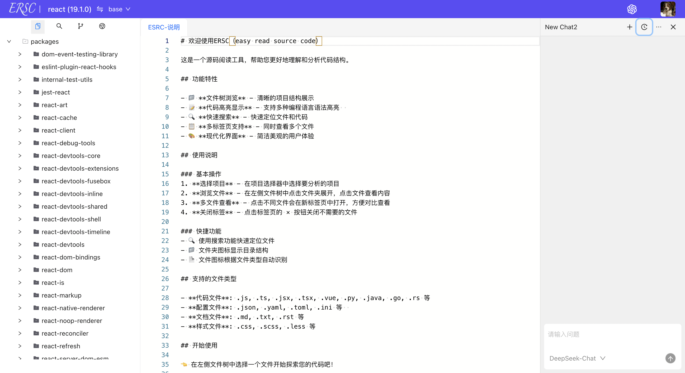

### eady read source code(让源码阅读起来更容易)

项目包括一个前端和后端服务，考虑尽可能减少服务，数据库直接使用的SQLite：

```javascript
// 启动前端
cd ersc-ui
pnpm install
pnpm dev
```

```javascript
// 启动后端服务
cd ersc-server
pnpm install
pnpm start
```

使用模型对话功能需要在`ersc-server/.env`中配置对应的deepseek(当前只支持)的key：

```
DEEPSEEK_API_KEY=自己的key
DEEPSEEK_BASE_URL=https://api.deepseek.com
DEEPSEEK_MODEL=deepseek-chat
DEEPSEEK_MAX_TOKENS=2048
DEEPSEEK_TEMPERATURE=0.7
```

### 效果预览


### 支持配置模型会话
